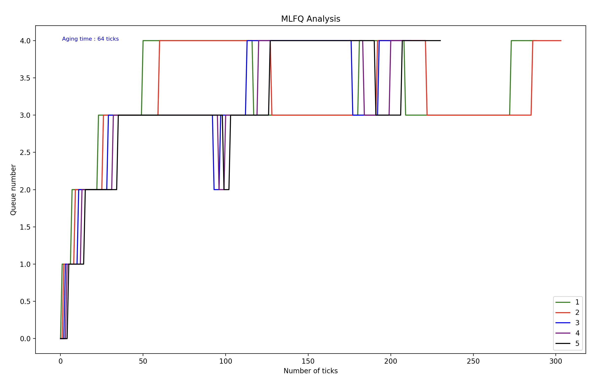

# <B>ASSIGNMENT 4</B>
## Operating System and Networks

### <B>Team Members-</B>
> Akshit Sharma (2021101029)

> Rudransh Agarwal (2021101033)
---

### COMMANDS TO RUN DIFFERENT FUCTIONALITIES
> `strace mask command [arguments]` 

> `settickets [no_tickets]`

> `setpriority [priority]`

---
### TO RUN DIFFERENT SCHEDULING ALGORITHMS

> `make qemu SCHEDULER=FCFS`

> `make qemu SCHEDULER=PBS`

> `make qemu SCHEDULER=LBS`

> `make qemu SCHEDULER=MLFQ`

> `make qemu `

---
### <U><B>SCHEDULING ALGORITHMS</B></U>
---
### FCFS (First Come First Serve)
    The First Come First Serve Scheduling Algorithm gives priority to scheduling processes based on their time of arrival in the ready queue. THe process which came first is scheduled first.

> Code Implementation

    In the scheduler function in proc.c, we search the array of processes to be scheduled (proc) and find the process with least ctime (arrived first). Then we do a context switch to make this the current process (we schedule this process by giving it to CPU).
---
### LBS (Lottery based Scheduling Algorithm)
    In this algorithm, tickets are assigned to each process, initially equal to those of parents. But, their value can be incresed later by the user.
    Based on the number of tickets, a process is proportionally assigned CPU time. A random number is chosen (between [1, total_no_of_tickets]) and we find where this number lies in the number of tickets of these processes. Accordingly, context switch is done.

> Code Implementation

    A function set_tickets() is defined and a corresponding system call is made (sys_settickets). At the start of scheduler function in proc.c, a random number is chosen using function in grind.c and process is chosen accordingly. In trap.c, in order to make the scheduler preemptive, the process calls yield(). Child process gets same number of tickets as parent by assigning tickets in fork(). Init process gets 1 ticket.
---
### PBS (Priority based scheduling Algorithm)

    In this scheduling algorithm, a process with highest priority is scheduled first. Priority can be defined on the bases of certain characteristics of the process. In this case, we take niceness (which is calculated from run time and sleeping time of the process) and static priority which is initially 60 and can be further set by user using set_priority system call.

> Code Implementation

    We used varibles rtime and stime in proc structure to store running time and sleeping time accordingly, whose values are updated in the update_time function. In scheduler function in proc.c, we iterate through the proc array. For each process, we calculate its DP (dynamic priority) using the given formula. The process with least value of DP is the one with the highest priority. So, we give the CPU to this process till its completes execution.
---
### MLFQ (Multi-Level Feedback Queue Scheduling Algorithm)

    In this scheduling, we maintain multiple ready-queues. Each process in these queues is allowed to move between them (based on their run time in this case). Here, we implement 5 queues (numbered 0 to 4). Initially, every process enters queue 0. Each queue gives a time-slice to each process inside it (equal to 1<<queue_number). If the process fails to complete in this time, it is demoted to the next queue. We also implemnt aging to avoid starvation. If a process is waiting in a queue for a long time, we age it to the next higher priority queue.

> Code Implementation

    The number of CPU's should be set to 1 first.We take the aging time as 64 ticks. We make a structure called queue. It implements a basic array based queue. It stores the index of head, tail, its size and an array called procs to store all the processes in it. We have defined an array of 5 queues. We have implementated the 4 basic functions for them (push, pop, top and remove). We also make changes to the proc struct to incorporate the queue number of the process (qnum), the time it entered this queue (qctime), the array inqtime to store the time this process spent in each of the queues, if it is this queue (inq) and the running time of this process i the current queue (runtime). In scheduler function in proc.c, we first check which process has aged and then remove it from the queue. We make its queue number decrease by 1 (higher priority). In the next loop, we check whichever processes are not in a queue and add them to the appropriate queue based on their qnum. We then schedule the first process in the highest priority queue. In trap.c, if a process has exceeded the time slice for its queue, we preempt it and assign it the next lower priority queue. If not, we check if any process has aged and make the appropriate changes. Finally, we check if any higher priority queue has a process. If it does, we preempt this process. To make the last queue (index 4) follow Round Robin algorithm by preempting any process running in it after each tick.
---
FCFS
Average rtime 72,  wtime 89

RR
Average rtime 32,  wtime 129

LBS
Average rtime 22,  wtime 126

PBS
Average rtime 32,  wtime 112 

MLFQ
Average rtime 22,  wtime 187 (aging = 64)

Clearly, FCFS has least waiting time. It's lower than RR because all processes wait in RR whereas in FCFS some processes wait for lesser time.

LBS has almost the same waiting time as RR whereas PBS has little lower. MLFQ has highest(running on only one CPU)

---
## MLFQ SCHEDULING ANALYSIS

